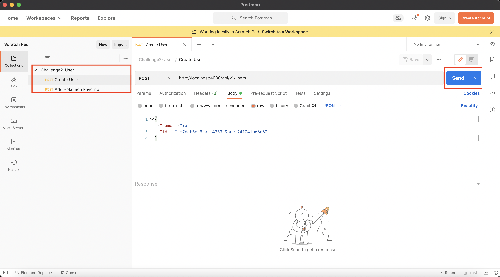
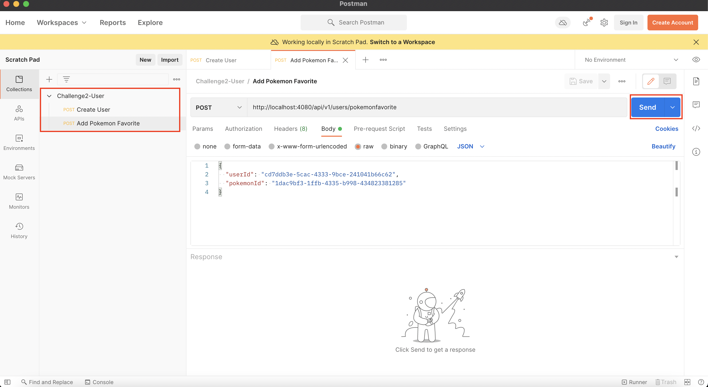

# Challenge #2

### Run App Steps:

1. Start the container:

    `docker-compose -f docker-compose-Reto2.yml  up -d --force-recreate`

2. Open Postman

3. Import `requestsChallenge2.json` clicking **Import** in Postman App

4. Make Requests:

    **4.1.** Create User

    Do the following request through postman by clicking **Send** the data is already setup 

    

    Exception Scenarios:  
    1. If you click again and try to register the same user the app will throw an exception (***UserAlreadyExistsException***) that indicates that the user already exist!   

    **4.2.** Add Pokemon Favorite

    Do the following request through postman by clicking **Send** the data is already setup 

    

    Exception Scenarios:  
    1. If you click again and try to add the same pokemon favorite the app will throw an exception (***PokemonFavoriteAlreadyExistException***) that indicates that the pokemon have been already added!       
    2. If you click again and try to add a pokemon favorite with the a user that not exists then the app will throw an exception (***UserDoesNotExistException***) that indicates that the user haven't been created!       

5. Run Tests:

    **5.1.** Go To Github Page

    To run the test in the app, you can do it in the github page, in the **action** menu indicates in the next image:

    

    **5.2.** Re-Run Jobs:

    

    **5.3.** Wait for pipeline

    **5.4.** Open Test Results

    

6. ¡Keep enjoying our App!

### [Return to README](README.md)