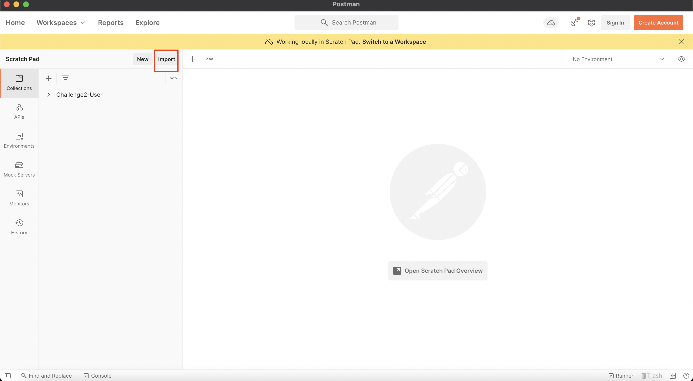
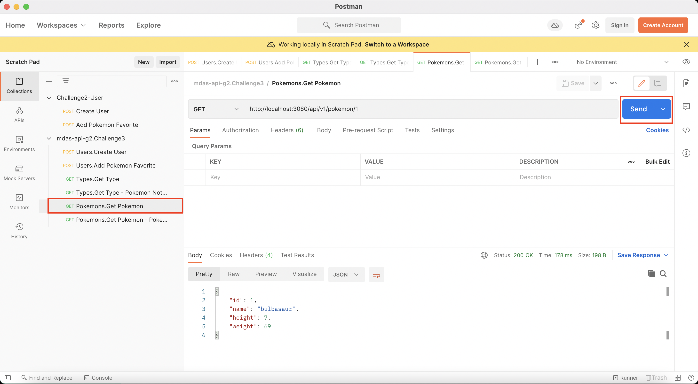
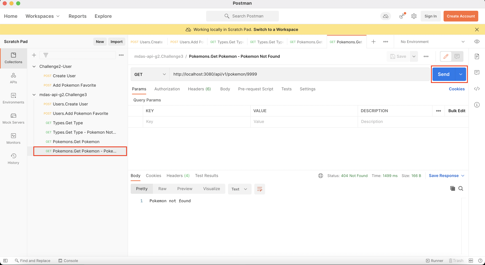

# Challenge #3

### Run App Steps:

1. Start the container:

    `docker-compose -f docker-compose-Reto3.yml  up -d --force-recreate`

2. Open Postman

3. Import `requestsChallenge3.json` clicking **Import** in Postman App

4. Make Requests:

    **4.1.** Get Pokemon By Id

    Do the following request through postman ***(Pokemons.Get Pokemon)*** by clicking **Send** the data is already setup 

    

    Exception Scenarios:  
    1. Change the id of a pokemon for `9999` and the app will throw the exception (***PokemonNotFoundException***) that indicates that the pokemon does not exist!   

    

5. Run Tests:

    **5.1.** Docker Test Container

    In docker you can check if all the test are passed.
    Just check the log of the container with the following command in your favorite terminal or cmd:

    `docker logs -f test`

6. ¡Keep enjoying our App!

### [Return to README](README.md)